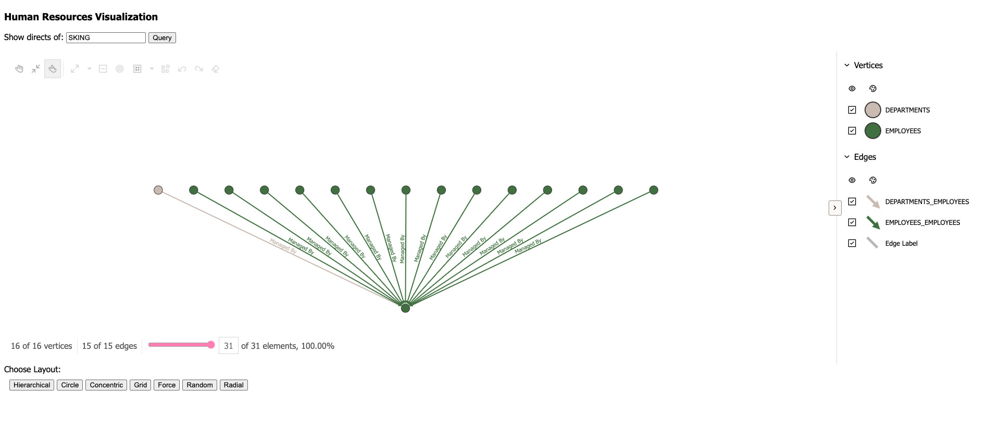

# Oracle Graph Visualization Demo Application 

A web application for interactively exploring Oracle property graphs. Connect to Oracle Graph Server, execute  SQL/PGQ or PGQL queries, and explore results as a live graph. Click nodes to expand neighbors, filter by label, and style graph elements by property value. An example Java web application based on [Micronaut](https://docs.micronaut.io/) which embeds Oracle's Graph Visualization library. The server queries the graph data from an Oracle AI Database using SQL.



The key source files to look at are

* `src/main/resources/public/index.html`: the HTML file served in the browser embedding the visualization library
* `src/main/java/com/oracle/example/HRController.java`: implements the REST endpoints called by `index.html`
* `src/main/java/com/oracle/example/GraphClient.java`: wraps the graph server APIs, called by HRController

## Features

- Force-directed and hierarchical layout options.
- PGQL and SQL:2023 query input with live graph rendering.
- Click-to-expand node exploration for fetching neighbors on demand.
- Node and edge styling by label, property value, or algorithm result such as PageRank score.

## Pre-requisites

1. Oracle JDK 17 (or OpenJDK 17)
2. A running Oracle AI Database 26ai or newer (e.g. [Oracle Autonomous AI Database](https://www.oracle.com/autonomous-database/))
3. Import the Human Resources dataset and create a Property Graph by running `./gradlew createHrDatasetAndPropertyGraph -Pjdbc_url=<jdbc_url> -Pusername=<username> -Ppassword=<password>`

* Note: The user must have `GRANT CREATE SESSION, CREATE TABLE, CREATE VIEW, CREATE SEQUENCE grants on the Database`
* Note 2: You can drop the HR dataset and the created Property Graph by running the following command: `./gradlew dropHrDatasetAndPropertyGraph -Pjdbc_url=<jdbc_url> -Pusername=<username> -Ppassword=<password>`

## Quick Start

1. Clone this repository 
2. Download the "Oracle Graph Visualization library" [from oracle.com](https://www.oracle.com/database/graph/downloads.html)
3. Unzip the library into the `src/main/resources/public` directory. For example:

```
unzip oracle-graph-visualization-library-25.4.0.zip -d src/main/resources/public/
```

4. Run the following command to start the example app locally:

```
./gradlew run --args='-oracle.jdbc-url=<jdbc-url> -oracle.username=<username> -oracle.password=<password>'
```

with

* `<jdbc-url>` being the JDBC URL of the Oracle Database should connect to, e.g. `jdbc:oracle:thin:@myhost:1521/orcl` 
* `<username>` being the Oracle Database username to authenticate the example application, e.g. `scott`
* `<password>` being the Oracle Database password to authenticate the example application, e.g. `tiger`

Then open your browser at `http://localhost:8080`.

When you click on the <em>Query</em> button, a request is made to `/hr/directs`, which fetches the direct reports of 
the given employee (by default `SKING`) from the HR graph using a SQL query. 

When you right-click on one of the resulting nodes and then select <em>Expand</em>, a request to `/hr/neighbors` is being 
made, which fetches the neighbors of that node via another SQL query.

## Version Compatibility

| Component | Supported Version |
| --- | --- |
| Oracle Graph Visualization Library (GVT) | 25.4+ |
| Oracle Graph Server | 26.x+ |
| Oracle AI Database | 26ai |
| Node.js | 18+ |

## Typical Workflow

1. Start Oracle Graph Server.
2. Create or load a property graph in Oracle AI Database.
3. Configure this app with the graph server URL and graph name.
4. Run a PGQL or SQL graph query.
5. Explore, filter, style, and export the rendered graph.

## Graph Visualization Developer's Guide

Find more information in the [Property Graph visualization documentation](https://docs.oracle.com/en/database/oracle/property-graph/26.2/pgvtr/index.html)

## Troubleshooting

If you get any errors,

* check the log output from the server on the terminal where the Gradle command is running
* use browser debug tools (e.g. Chrome Developer Tools) to inspect request/response and console logs